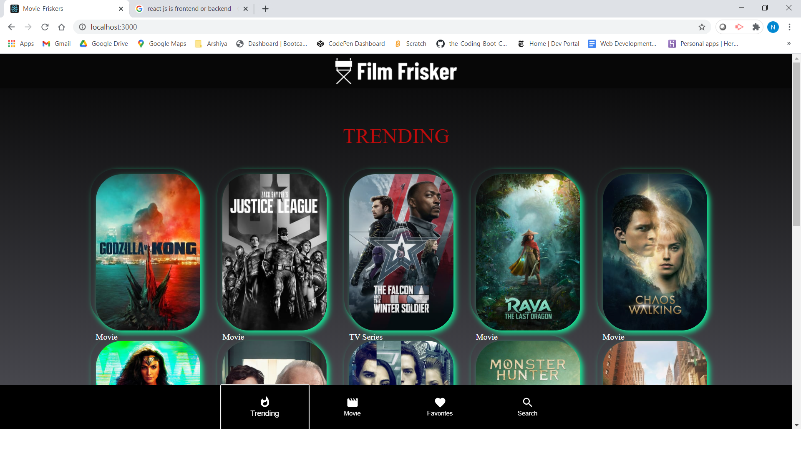

# ABOUT

Film frisker is an application for movie lovers to sort, store, and discover their favorite and soon-to-be favorite films and shows.
IT'S an **MERN** Application. **(MONGO EXPRESS REACT NODE)**.All the folder structure is in **MVC**.This application is fully 
responsive as well.

  [USER-STORY](#USER-STORY)

  [DETAILS](#DETAILS)

 [RESOURCES-REFERRED](#RESOURCES-REFERRED)

 [TEXT-EDITOR](#TEXT-EDITOR)

 [PROGRAMMING-LANGUAGES](#PROGRMMING-LANGUAGE)

 [FRAMEWORK-USED](#FRAMEWORK-USED)

 [TWO-TECHNONOLOGIES-USED](#TWO-TECHNONOLOGIES-USED)

[Installation](#Installation)

[DATABASE](#DATABASE)

[USAGE](#USAGE)

 [Roadmap](#Roadmap)

 [GIT-HUB-REPOSITORY](#LINKS)
 
 [HEROKU--DEPLOYED-Application](#LINKS)

 [Screenshots](#Screenshots)

 [GIF-DEMO](#GIF-DEMO)

 [Authors](#Authors)


# USER-STORY
As User, able to see **movies&TV-series** on the **TRENDING** page.
As User, able to see more **DESCRIPTION** about **movies/Tv-series** , when click on 
any **CARD** on the trending page and also see their **TRAILOR** on the **YOUTUBE**.
As User, able to see only movies on **MOVIES** page, with **FAVORITE** Icon on the card
so user can save the movies on the **FAVORITE** page.
As a User, able to **SEARCH** the movies on the **SEARCH** page.Getting all the movie information 
by using the  **MOVIEDB-API**.

# DETAILS

User is presented with landing page with **BOTTOM NAVOGATION LINKS** and as
**TRENDING** as a home page with trending movies and tv series . Cards are clickable
 with the help of **REACT_MATERIAL_UI_MODAL** to get more description on the trending movies 
 and tv series with the respective **trailor-links** on the youtube. ALSO, user can save 
 the movies by clicking on **FAV_HEART_ICON** on the movies page and can see the saved movies in the 
 **FAVORITE** page. User can also do the search on the movies on the **SEARCH** page.
 On **SEARCH** page , if movie poster is unavailable , it is presented with the default image.
 All the favorites movies are stored in the database(MONGODB).
 STARTER-COMMAND 
 ```
 npm start
 ```

 

## Installation

Use npm installer to install all packages and depenencies for Film Frisker.

```bash
npm install

```
## TEXT-EDITOR
VS-CODE

## PROGRAMMING-LANGUAGES
**REACT-JS**

**CSS**

## FRAMEWORK-USED

**FLEXBOX**
    
## DATABASE

 **MONGODB**


## TWO-TECHNONOLOGIES-USED

**REACT-MATERIAL-UI**

  --- material-ui-core--

  ----material-ui-icons--

  ---material-ui-modal--

  ----material-ui-badge--

**WIX**

     ---for the logo on trending page---

## Usage
The Movie Database API

React

Material UI

Axios

Express

MongoDB


## RESOURCES-REFERRED


[Bottom-Navigation](https://material-ui.com/components/bottom-navigation/)

[Badge](https://material-ui.com/components/badges/)

[Modal-React-Transition-Group](https://material-ui.com/components/modal/#modal)

[History-push](https://reactrouter.com/web/api/Hooks/usehistory)

[React-Material-ui](https://material-ui.com/)

[Stackover-flow](https://stackoverflow.com/questions/53051465/react-hooks-what-why-useeffect)

[API-USED](https://www.themoviedb.org/?language=en-US)


## Links
[GIT-HUB-REPOSITORY](https://github.com/Afam-26/final-project)

[HEROKU-Deployed-Application](https://film-frisker.herokuapp.com/)

## Screenshots



## GIF-DEMO


## Roadmap
Future versions to include
genre sorting
tv section
click-to-view (on netflix, hulu, fandango, etc)
more stuff

## Authors
**Nehreet Kaur, Afam Anekeh, Justin Bush**

 **Elmer Hernandez, Gabriel Gonzales, Noe Rios**


